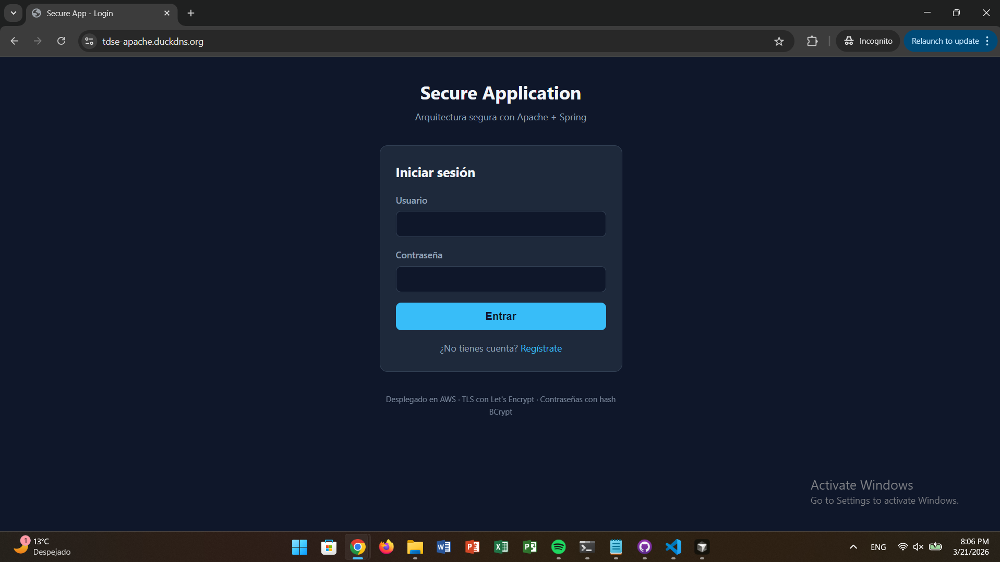
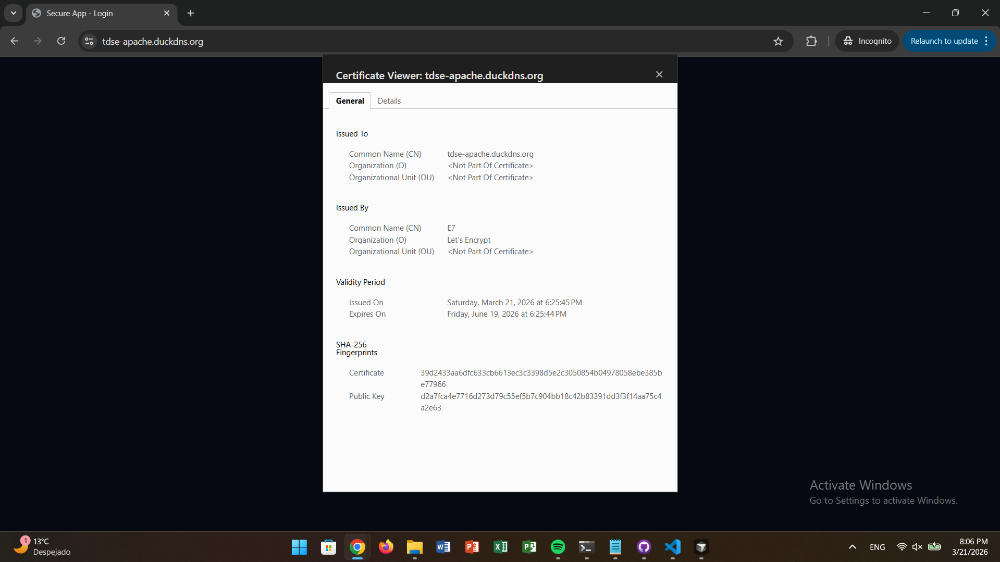
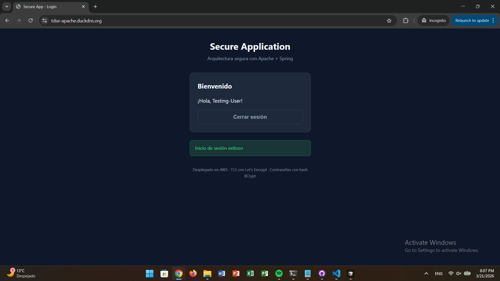
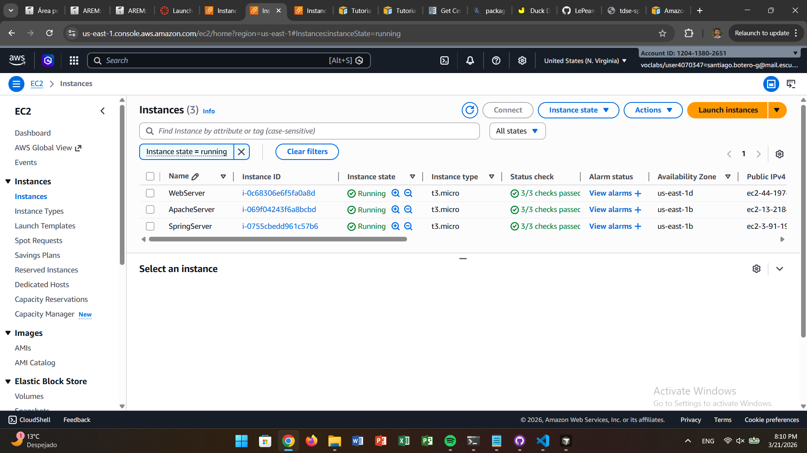

# Secure Application Design

**Escuela Colombiana de Ingeniería Julio Garavito**  
**Student:** Santiago Botero García

This project implements a secure web application following enterprise architecture best practices. It consists of a two-tier deployment on AWS: **Apache** (web tier) serves the static frontend, and **Spring Boot** (application tier) exposes a REST API for authentication and user management. The application demonstrates TLS encryption with Let's Encrypt, BCrypt password hashing, and stateless token-based authentication. The client uses asynchronous JavaScript (`fetch` with `async/await`) to communicate with the backend over HTTPS.

## Features

- **TLS Encryption** — End-to-end encryption using Let's Encrypt certificates on both Apache and Spring Boot servers
- **Asynchronous HTML+JavaScript Client** — Frontend using `fetch` and `async/await` for non-blocking API communication; no page reloads
- **Secure Login & Registration** — BCrypt password hashing; credentials never stored in plain text; validation via Jakarta Bean Validation
- **Stateless Token Authentication** — UUID-based bearer tokens with 8-hour TTL; tokens validated by `BearerTokenAuthFilter`
- **AWS Deployment** — Two EC2 instances: one for Apache (web tier), one for Spring Boot (application tier)
- **CORS Configuration** — Cross-origin resource sharing configured in Spring for frontend-backend separation
- **In-Memory User Store** — `UserStore` with `ConcurrentHashMap` for demo purposes; easily replaceable with a database

## Project Structure

```
secure-app-architecture-aws/
├── application-tier/          # Spring Boot backend
│   ├── src/main/java/co/edu/escuelaing/demo/
│   │   ├── auth/              # AuthService, TokenService, UserStore
│   │   ├── config/            # AuthBeansConfig, CorsConfig
│   │   ├── controllers/       # LoginController, MeController, HelloController
│   │   ├── security/          # SecurityConfig, BearerTokenAuthFilter
│   │   └── Application.java
│   ├── src/main/resources/
│   │   ├── application.properties
│   │   └── keystore/          # PKCS12 keystore for TLS
│   └── pom.xml
├── web-tier/                  # Apache static frontend
│   ├── index.html             # Login, register, dashboard UI
│   ├── styles.css             # Styling
│   ├── config.js              # API_BASE_URL configuration
│   ├── api.js                 # Async API client (fetch)
│   ├── app.js                 # UI logic and event handlers
│   ├── httpd.conf.example     # Apache configuration template
│   └── deploy/
│       ├── install-apache.sh  # Installs httpd on Amazon Linux
│       └── deploy-to-apache.sh# Copies files to /var/www/html
├── img/                       # Screenshots for documentation
└── README.md
```

## API Endpoints (Spring Boot)

| Method | Endpoint | Auth | Description |
|--------|----------|------|-------------|
| POST | `/auth/register` | No | Register user; body: `{username, password}` |
| POST | `/auth/login` | No | Login; returns `{token}`; body: `{username, password}` |
| GET | `/api/me` | Bearer | Returns `{username}` for authenticated user |
| GET | `/hello` | No | Health check; returns greeting string |

## Architecture

The browser loads static files (HTML, CSS, JS) from Apache. The JavaScript runs in the client and makes direct HTTPS requests to the Spring Boot API. Apache does not proxy API requests; the client communicates with both servers independently.

### High-Level Overview

```
┌─────────────────┐
│  User Browser   │
│  (HTML + JS)    │
└────────┬────────┘
         │
         │ HTTPS (static)          │ HTTPS (API)
         ▼                         ▼
┌─────────────────┐        ┌──────────────────┐
│ Apache (EC2 1)  │        │ Spring Boot      │
│ /var/www/html   │        │ (EC2 2)          │
│ index.html      │        │ /auth/*, /api/*  │
│ app.js, etc.    │        │ BCrypt, Tokens   │
└─────────────────┘        └──────────────────┘
```

### Architecture Diagram (Mermaid)

```mermaid
graph TD
    subgraph Client["Client Layer"]
        A[User Browser]
        B[index.html + app.js]
        C[api.js - fetch async/await]
    end

    subgraph WebTier["Web Tier - EC2 Instance 1"]
        D[Apache HTTP Server]
        E[/var/www/html<br/>Static Files]
        F[TLS - Let's Encrypt]
    end

    subgraph AppTier["Application Tier - EC2 Instance 2"]
        G[Spring Boot :5000]
        H[LoginController<br/>/auth/register, /auth/login]
        I[MeController<br/>/api/me]
        J[AuthService + BCrypt]
        K[TokenService 8h TTL]
        L[UserStore in-memory]
    end

    A --> B
    B --> C
    C -->|HTTPS| D
    D --> E
    D --> F
    C -->|HTTPS fetch| G
    G --> H
    G --> I
    H --> J
    H --> K
    J --> L
```

### Request Flow

```mermaid
sequenceDiagram
    participant U as User
    participant A as Apache
    participant S as Spring Boot

    U->>A: GET / (HTTPS)
    A->>U: index.html, app.js, styles.css

    U->>S: POST /auth/register {username, password}
    S->>S: BCrypt.encode(password)
    S->>U: 204 No Content

    U->>S: POST /auth/login {username, password}
    S->>S: BCrypt.matches(password, hash)
    S->>S: TokenService.issueToken()
    S->>U: 200 {token}

    U->>S: GET /api/me Authorization: Bearer &lt;token&gt;
    S->>S: BearerTokenAuthFilter validates
    S->>U: 200 {username}
```

## Installation

### Prerequisites

- AWS account with EC2 access
- Domain name (required for Let's Encrypt; does not work with IP only)
- SSH key pair for EC2 access
- Java 17+ and Maven (for Spring Boot build)

### Step 1: Create EC2 Instances

Create two EC2 instances on AWS with **Amazon Linux 2023**:

| Instance | Purpose | Security Group |
|----------|---------|----------------|
| Instance 1 | Apache (Web Tier) | HTTP (80), HTTPS (443), SSH (22) |
| Instance 2 | Spring Boot (Application Tier) | Port 5000 or 443, SSH (22) |

### Step 2: Deploy Apache (Web Tier)

```bash
# Connect via SSH
ssh -i your-key.pem ec2-user@<APACHE_PUBLIC_IP>

# Manual installation
sudo dnf install httpd -y
sudo systemctl start httpd
sudo systemctl enable httpd

# Deploy frontend files (from project root)
cd web-tier
sudo cp index.html styles.css config.js api.js app.js /var/www/html/

# Configure API URL: edit /var/www/html/config.js
# Set API_BASE_URL to your Spring backend URL (e.g. https://your-spring.duckdns.org)

# Install Let's Encrypt (requires domain)
sudo dnf install certbot python3-certbot-apache -y
sudo certbot --apache
```

### Step 3: Deploy Spring Boot (Application Tier)

```bash
# Build
cd application-tier
mvn clean package

# Transfer JAR to EC2
scp -i your-key.pem target/demo-0.0.1-SNAPSHOT.jar ec2-user@<SPRING_PUBLIC_IP>:~

# On EC2: Install Java and run
ssh -i your-key.pem ec2-user@<SPRING_PUBLIC_IP>
sudo dnf install java-17-amazon-corretto -y

# Configure environment
export PORT=5000
export CORS_ALLOWED_ORIGINS=https://your-apache-domain.com
export SSL_ENABLED=true   # if using TLS
export KEYSTORE_PATH=file:/path/to/keystore.p12
export KEYSTORE_PASSWORD=yourpassword

# Run
java -jar demo-0.0.1-SNAPSHOT.jar
```

**TLS with Let's Encrypt (Spring):**

```bash
sudo certbot certonly --standalone -d your-spring-domain.com
sudo openssl pkcs12 -export -in /etc/letsencrypt/live/your-domain/fullchain.pem \
  -inkey /etc/letsencrypt/live/your-domain/privkey.pem -out keystore.p12 \
  -name springboot -password pass:CHANGEME
```

Set `KEYSTORE_PATH`, `KEYSTORE_PASSWORD`, and `SSL_ENABLED=true`.

### Step 4: Configure CORS

Set `CORS_ALLOWED_ORIGINS` to your Apache domain (e.g. `https://your-apache.duckdns.org`). This is required because the browser enforces same-origin policy and the frontend (Apache) and backend (Spring) run on different origins.

### Local Development

**Spring Boot:**
```bash
cd application-tier
mvn spring-boot:run
# Runs on https://localhost:5000 (if SSL enabled) or http://localhost:5000
```

**Web Tier:**
```bash
cd web-tier
python -m http.server 8080
# Open http://localhost:8080
# Edit config.js: API_BASE_URL = 'https://localhost:5000' or 'http://localhost:5000'
```

## Usage

1. **Access**: Navigate to `https://your-apache-domain.com` in your browser.
2. **Register**: Click "Regístrate", enter username and password, submit.
3. **Login**: Enter credentials and click "Entrar".
4. **Dashboard**: After login, the welcome message with your username is displayed.
5. **Logout**: Click "Cerrar sesión" to clear the token and return to the login screen.

The token is stored in `localStorage` and sent as `Authorization: Bearer <token>` on protected requests.

## Screenshots









## Video Demonstration

The video should show: (1) the application running, (2) login and registration flow, (3) HTTPS active (padlock in browser).

**Video link**: [Your video URL]

## Security Implementation

### TLS/HTTPS Encryption

- **Apache**: TLS via Certbot and Let's Encrypt. HTTP can be redirected to HTTPS. Certificate management: `sudo certbot --apache`.
- **Spring Boot**: TLS configurable via `application.properties`. Uses PKCS12 keystore. Environment variables: `SSL_ENABLED`, `KEYSTORE_PATH`, `KEYSTORE_PASSWORD`, `KEYSTORE_TYPE`, `KEY_ALIAS`. For production, use Let's Encrypt certificates converted to PKCS12.

### Password Security

- **BCrypt** via `BCryptPasswordEncoder` in `AuthBeansConfig`.
- Registration: `userStore.put(username, passwordEncoder.encode(password))`.
- Login: `passwordEncoder.matches(rawPassword, storedHash)`.
- Plain-text passwords are never persisted.

### Token-Based Authentication

- **TokenService** issues UUID tokens with 8-hour TTL (`Duration.ofHours(8)`).
- Tokens stored server-side in `ConcurrentHashMap`; client receives token and stores in `localStorage`.
- **BearerTokenAuthFilter** reads `Authorization: Bearer <token>`, validates via `TokenService.resolveUsername()`, and sets Spring Security context.
- Public endpoints: `/hello`, `/auth/**`. Protected: `/api/**`.

### Server Separation

- Apache (web tier) and Spring Boot (application tier) run on separate EC2 instances.
- Reduces blast radius and allows independent scaling and security hardening.

### CORS

- **CorsConfig** allows origins from `cors.allowed-origins` (configurable via `CORS_ALLOWED_ORIGINS`).
- Methods: GET, POST, OPTIONS. Headers: Content-Type, Authorization.

### CSRF

- CSRF disabled (`csrf.disable()`) because the API is stateless and uses Bearer tokens (no cookies for auth).

## References

* AWS Amazon Linux 2023 Guide: [https://docs.aws.amazon.com/linux/al2023/ug/ec2-lamp-amazon-linux-2023.html](https://docs.aws.amazon.com/linux/al2023/ug/ec2-lamp-amazon-linux-2023.html)
* Spring Security Guide: [https://spring.io/guides/gs/securing-web](https://spring.io/guides/gs/securing-web)
* Let's Encrypt Documentation: [https://letsencrypt.org/docs/](https://letsencrypt.org/docs/)
