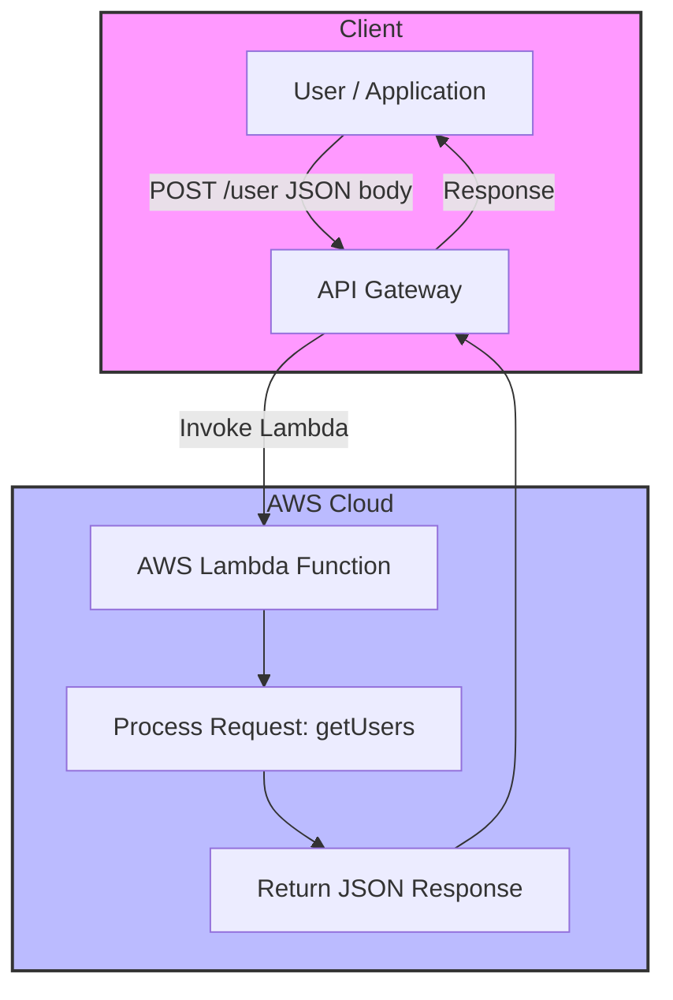
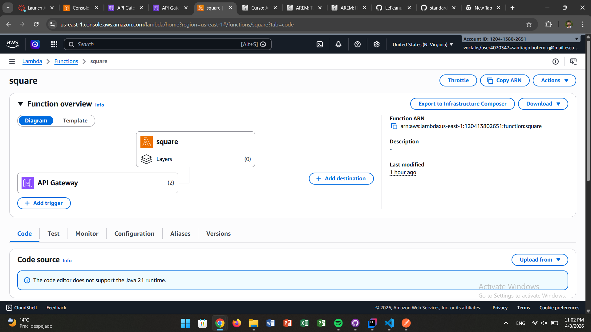
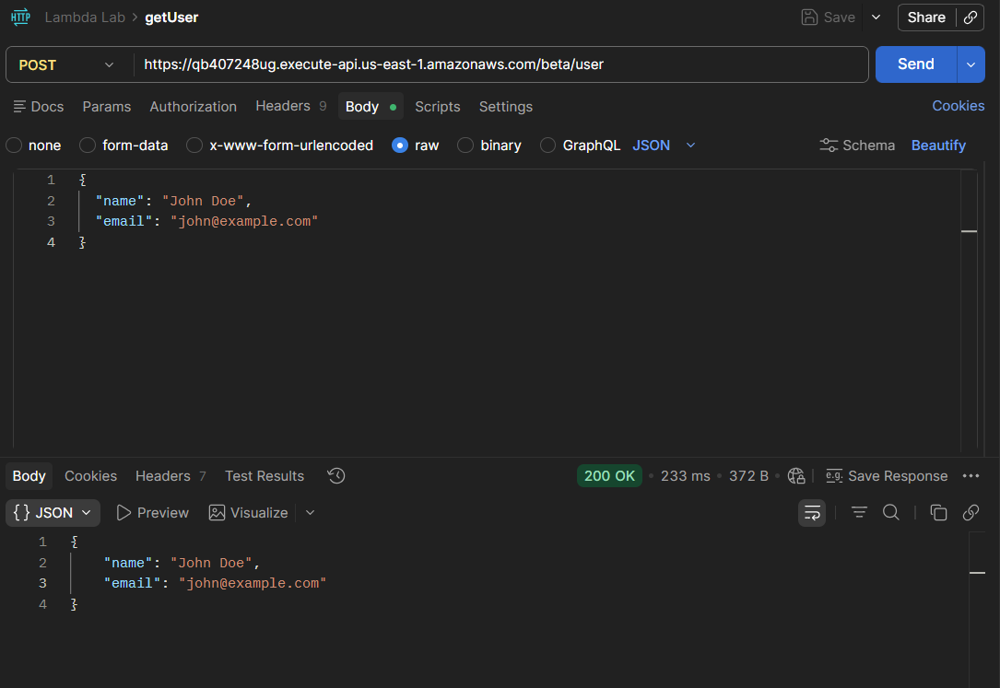
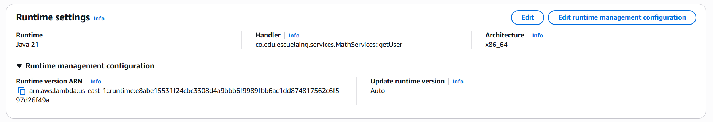
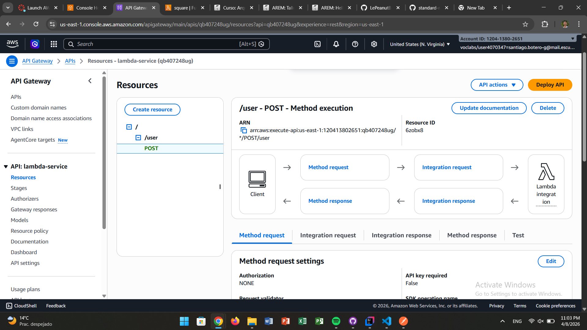
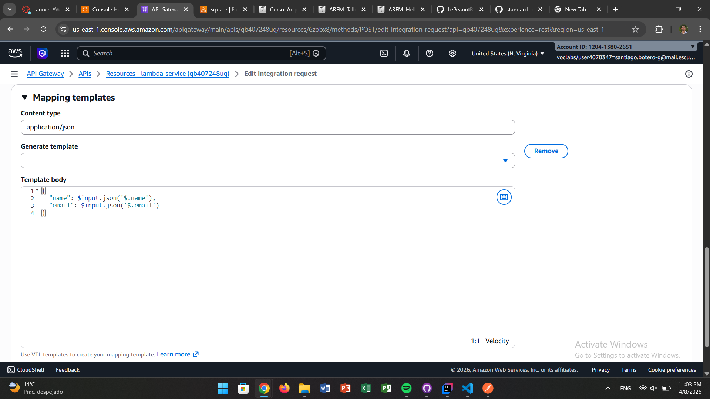
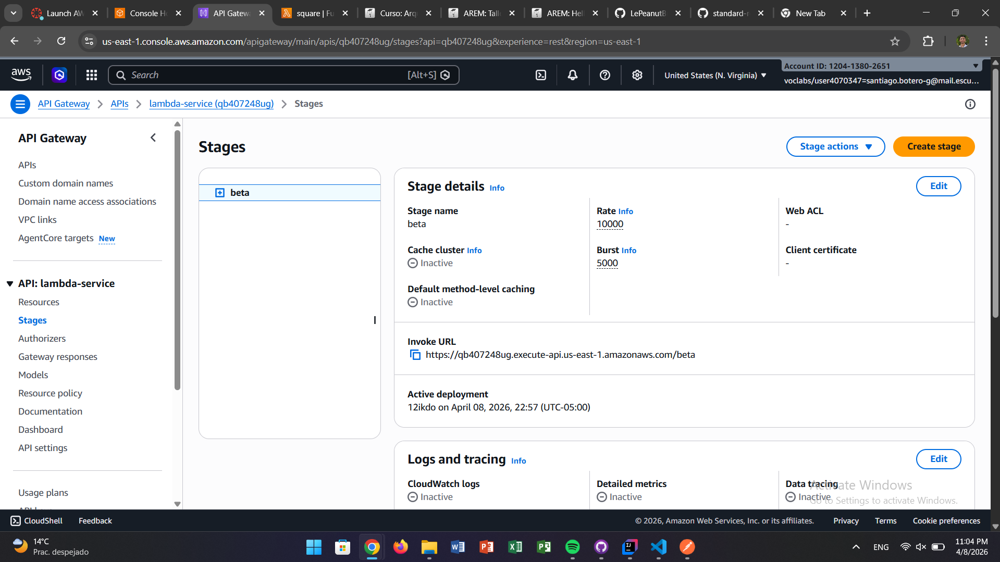
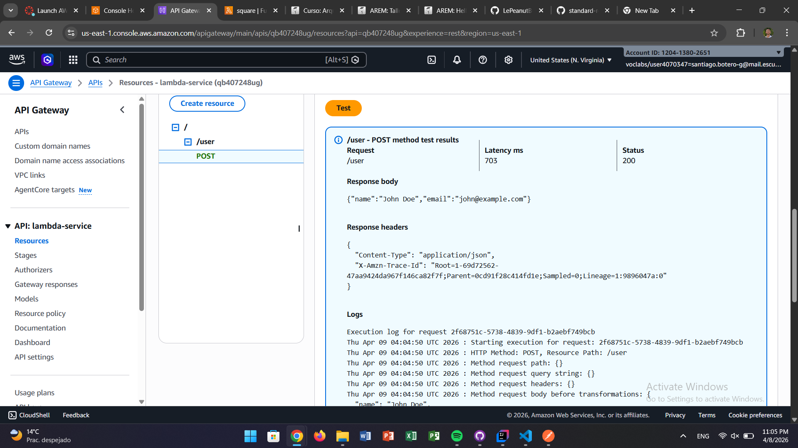

# Serverless Java API with AWS Lambda & API Gateway

[](https://github.com/RichardLitt/standard-readme)

**Escuela Colombiana de Ingeniería Julio Garavito**  
**Student:** Santiago Botero García

A serverless REST API built with Java using AWS Lambda and API Gateway, demonstrating body-based request handling with a more realistic microservice (`getUsers`).

This project evolves from a basic introductory example (a simple square function) into a more advanced implementation using structured JSON input.

---

## Table of Contents

* [Background](#background)
* [Install](#install)
* [Usage](#usage)
* [API Design](#api-design)
* [AWS Deployment](#aws-deployment)
* [Example Request](#example-request)
* [Related Efforts](#related-efforts)

---

## Background

This project introduces serverless microservices using Java on AWS.

Initially, a simple function was implemented (a square calculator) using query parameters to demonstrate the basics of AWS Lambda integration.

This repository extends that idea by implementing a more realistic service:

* Uses **JSON request body instead of query parameters**
* Handles structured input (`name`, `email`)
* Demonstrates API Gateway mapping templates for body parsing

This reflects real-world API design patterns where services consume and process structured data.



---

## Install

### Requirements

* Java 8+
* Maven
* AWS Account
* AWS Lambda & API Gateway access
* IDE (NetBeans, IntelliJ, Eclipse)

### Build the project

```sh
mvn clean package
```

This generates a `.jar` file that will be deployed to AWS Lambda.

---

## Usage

The core functionality is exposed through a Lambda function integrated with API Gateway.

Unlike the initial example (square function), this service:

* Accepts **POST requests**
* Requires a **JSON body**
* Extracts user data (`name`, `email`)



---

## API Design

### Endpoint

```
POST /user
```

### Input (Request Body)

```json
{
  "name": "John Doe",
  "email": "john@example.com"
}
```

### Key Differences from Basic Example

| Feature    | Basic Example (Square) | getUsers       |
| ---------- | ---------------------- | -------------- |
| Input Type | Query Parameter        | JSON Body      |
| Complexity | Simple                 | Structured     |
| Use Case   | Demo                   | Real-world API |



---

## AWS Deployment

### 1. Create Lambda Function

* Go to AWS Lambda
* Create function from scratch
* Runtime: Java 21
* Upload `.jar`
* Configure handler:

```
<package.ClassName>::<methodName>
```



---

### 2. Configure API Gateway

* Create a REST API
* Add a `POST` method
* Integrate with Lambda



---

### 3. Mapping Template

To handle JSON input, configure a mapping template:

```json
{
  "name": "$input.json('$.name')",
  "email": "$input.json('$.email')"
}
```

This ensures the Lambda function receives structured data correctly.



---

### 4. Deploy API

* Deploy to a stage (e.g., `beta`, `dev`, `prod`)
* Use generated endpoint URL



---

## Example Request

### HTTP Request

```http
POST /user
Content-Type: application/json
```

### Body

```json
{
  "name": "John Doe",
  "email": "john@example.com"
}
```



---

## Related Efforts

* Serverless architectures on AWS
* Java-based microservices
* API Gateway mapping templates
