# Java Annotation-Based REST Framework with IoC Container

[](https://github.com/RichardLitt/standard-readme)

**Escuela Colombiana de Ingeniería Julio Garavito**  
**Student:** Santiago Botero García

A lightweight annotation-driven Java 21 web framework built from scratch using TCP sockets, featuring a custom IoC container, controller-based routing, and REST API design aligned with the Richardson Maturity Model.

## Table of Contents

* [Background](#background)
* [Architectural Evolution](#architectural-evolution)
* [Richardson Maturity Model Adoption](#richardson-maturity-model-adoption)
* [Architecture](#architecture)
* [controller Package](#controller-package)
* [ioc Package](#ioc-package)
* [Core Features](#core-features)
* [Install](#install)
* [Usage](#usage)
* [Project Structure](#project-structure)
* [Testing](#testing)
* [AWS Deploment](#aws-deployment)
* [Screenshots](#screenshots)
* [Outcome and Learning Results](#outcome-and-learning-results)

## Background

This project is an evolution of a previously implemented TCP-based HTTP server that:

* Opened port 8080 manually.
* Registered routes using lambda expressions.
* Served static files.
* Parsed HTTP requests manually.

In this new iteration, the same low-level HTTP server infrastructure was reused, but the architectural model was significantly redesigned to resemble a simplified version of the Spring Framework.

The primary objective of this version was to:

* Replace lambda-based route registration with annotation-driven controllers.
* Implement a custom Inversion of Control (IoC) container.
* Introduce metadata-based component scanning via `ControllerScanner`.
* Apply REST maturity principles using the Richardson Maturity Model.
* Structure the framework in a layered architecture under `co.edu.escuelaing`.

This project moves from a minimal HTTP server toward a true micro-framework.

## Architectural Evolution

### Previous Version

* Route registration via:

  ```java
  get("/hello", (req, res) -> "Hello World");
  ```
* Manual route registry in `RouteRegistry`.
* Functional-style endpoint mapping with `RouteHandler`.
* Flat routing structure.
* No controller abstraction.

### Current Version

* Annotation-based controllers using `@RestController` and `@GetMapping`.
* Automatic component scanning via `ControllerScanner` (recursive classpath scan).
* Reflection-based method invocation in `ApplicationContext`.
* IoC container (`ApplicationContext`) for controller instantiation and route registration.
* Separation of concerns with a dedicated `controller` package.
* REST endpoints organized with resource-oriented paths (e.g. `/greeting`, `/math/constants/pi`).

The framework mimics core Spring concepts, including:

* `@RestController`
* `@GetMapping`
* `@RequestParam`
* Annotation metadata processing at runtime
* Controller instantiation and route registration via the IoC container

All annotations and the IoC logic were manually implemented (no Spring dependency).

## Richardson Maturity Model Adoption

The API design follows the Richardson Maturity Model:

### Level 0 – Single Endpoint

Previously, all services were flat and not resource-oriented.

### Level 1 – Resource-Based URIs

Endpoints are now structured around resources:

```
/greeting
/greeting?name=Santiago
/math/constants/pi
```

Paths like `/math/constants/pi` reflect hierarchical resource identification.

### Level 2 – HTTP Method Awareness

The framework differentiates requests by HTTP method. Currently, **GET** is supported via:

* `@GetMapping` annotation on controller methods
* `RouteRegistry` for GET routes only
* `ConnectionHandler` resolving GET requests through `RouteRegistry.findGetRoute()`

POST, PUT, and DELETE are not yet implemented.

### Level 3 – Hypermedia (Future)

The current design returns plain text. Hypermedia and HATEOAS patterns are envisioned as future extensions.

## Architecture

### High-Level Architecture

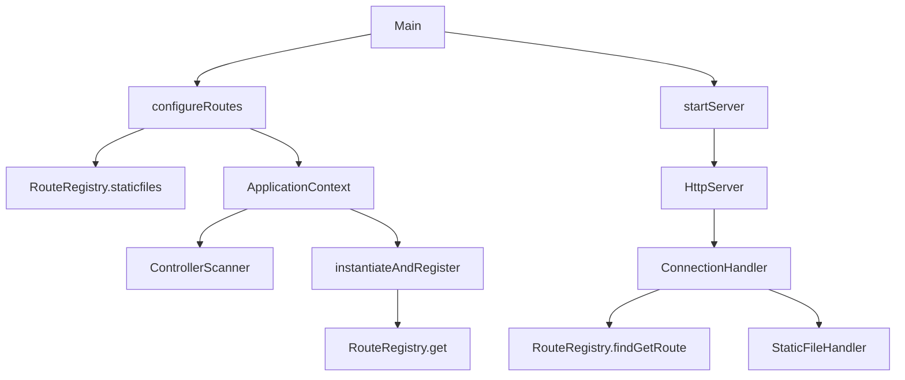

### Package-Level Architecture

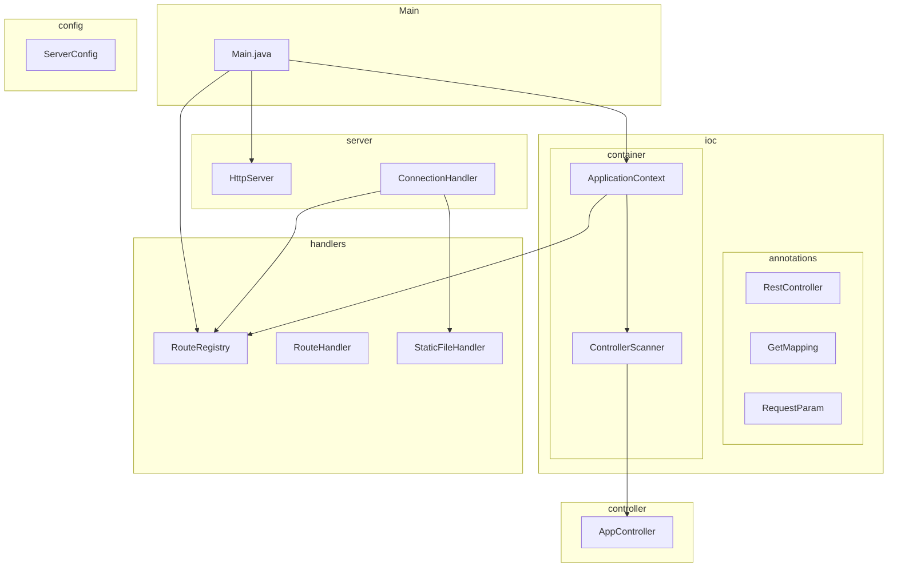

### Request Flow

1. `Main.main()` calls `configureRoutes()` and `startServer()`.
2. `ApplicationContext.loadControllers()` creates a `ControllerScanner`, scans the base package for `@RestController` classes, instantiates them, and registers each `@GetMapping` method in `RouteRegistry`.
3. `HttpServer` listens on port 8080 and delegates each connection to `ConnectionHandler`.
4. `ConnectionHandler` parses the request, checks `RouteRegistry.findGetRoute(path)` for GET requests, or falls back to `StaticFileHandler`.
5. For matched routes, the registered `RouteHandler` (a lambda delegating to the controller method) is invoked via reflection.

## controller Package

**Location:** `src/main/java/co/edu/escuelaing/controller/`

**Purpose:** Contains REST controllers-Java classes annotated with `@RestController` that expose HTTP GET endpoints through `@GetMapping` methods.

Controllers must:

* Reside under the base package `co.edu.escuelaing` (or a subpackage) so `ControllerScanner` can discover them.
* Be annotated with `@RestController`.
* Define methods annotated with `@GetMapping(value = "/path")` that return `String`.
* Use `@RequestParam` for query parameters; methods with no parameters are also supported.

### AppController (Actual Implementation)

```java
package co.edu.escuelaing.controller;

import co.edu.escuelaing.ioc.annotations.GetMapping;
import co.edu.escuelaing.ioc.annotations.RequestParam;
import co.edu.escuelaing.ioc.annotations.RestController;

@RestController
public class AppController {

    @GetMapping("/greeting")
    public String greeting(@RequestParam(value = "name", defaultValue = "World") String name) {
        return "Hola " + name;
    }

    @GetMapping("/math/constants/pi")
    public String getPi() {
        return String.valueOf(Math.PI);
    }
}
```

## ioc Package

**Location:** `src/main/java/co/edu/escuelaing/ioc/`

**Purpose:** Provides the Inversion of Control mechanism-custom annotations and the IoC container that scans, instantiates, and registers controllers automatically.

### Structure

```
ioc/
├── annotations/
│   ├── RestController.java   # Marks a class as a REST controller
│   ├── GetMapping.java       # Binds an HTTP GET path to a method
│   └── RequestParam.java     # Binds a query parameter with optional defaultValue
└── container/
    ├── ApplicationContext.java   # IoC container; loads controllers and registers routes
    └── ControllerScanner.java    # Recursive classpath scanner for @RestController classes
```

### annotations

| Annotation      | Target    | Purpose                                                                 |
|-----------------|-----------|-------------------------------------------------------------------------|
| `@RestController` | Class     | Marks a class as a REST controller. Used by `ControllerScanner` to discover controllers. |
| `@GetMapping`     | Method    | Maps an HTTP GET path to a method. The `value` is the route (e.g. `/greeting`). |
| `@RequestParam`   | Parameter | Binds a query parameter. Supports `value` (param name) and `defaultValue`. Parameters without a value when `defaultValue` is empty cause an error. |

### container

| Class               | Purpose                                                                 |
|---------------------|-------------------------------------------------------------------------|
| `ApplicationContext`| Accepts a base package, creates `ControllerScanner`, instantiates controllers with a default constructor, and registers each `@GetMapping` method in `RouteRegistry`. Resolves `@RequestParam` from `HttpRequest.getValues()`. |
| `ControllerScanner` | Scans the classpath (file system and JAR) recursively for classes with `@RestController`. Uses `ClassLoader.getResources()` and recursive directory traversal. |

### Usage in Main

```java
private static void configureRoutes() {
    RouteRegistry.staticfiles(STATIC_FOLDER);

    ApplicationContext context = new ApplicationContext(BASE_PACKAGE);
    context.loadControllers();
}
```

`BASE_PACKAGE` is `"co.edu.escuelaing"`. All controllers under this package (and subpackages) are discovered and registered.


## Core Features

### 1. Custom Annotation System

The framework includes manually implemented annotations:

* `@RestController`
* `@GetMapping`
* `@RequestParam`

These annotations are processed via reflection at runtime. There is no `@RequestMapping`; each method defines its full path in `@GetMapping(value)`.

### 2. IoC Container (ApplicationContext)

The custom IoC container:

* Scans the base package for `@RestController` classes via `ControllerScanner`.
* Instantiates controllers using a no-arg constructor.
* Registers each `@GetMapping` method in `RouteRegistry` as a GET route.
* Resolves `@RequestParam` from the incoming `HttpRequest` (query parameters).

This replaces manual `get(path, handler)` calls.

### 3. Controller-Based Routing

Endpoints are declared in controller classes. The actual `AppController` exposes:

* `GET /greeting` - optional `name` query param (default: `"World"`).
* `GET /math/constants/pi` - returns `Math.PI` as a string.

Routing is path-based and resolved by `RouteRegistry.findGetRoute()` in `ConnectionHandler`.

### 4. Reflection-Based Handler Execution

When a GET request arrives:

1. `ConnectionHandler` parses the request into `HttpRequest`.
2. `RouteRegistry.findGetRoute(path)` returns the registered `RouteHandler` (lambda).
3. The lambda invokes the controller method via reflection with parameters resolved from `@RequestParam`.
4. The method returns a `String`, which is sent back as the response body.

### 5. Static File Support

`RouteRegistry.staticfiles("webroot")` configures static file resolution from `src/main/resources/webroot`. If no GET route matches, `StaticFileHandler` attempts to serve a file (e.g. `index.html`).

## Install

### Requirements

* Java 21+
* Maven
* Git

### Build

```bash
mvn clean install
```

## Usage

### Run the Server

```bash
mvn exec:java
```

Or run the main class `co.edu.escuelaing.Main` from your IDE.

Server runs at:

```
http://localhost:8080
```

### Example REST Calls

```
GET http://localhost:8080/greeting
GET http://localhost:8080/greeting?name=Santiago
GET http://localhost:8080/math/constants/pi
```

Static files:

```
http://localhost:8080/index.html
http://localhost:8080/styles.css
```

## Project Structure

The project follows Maven conventions with packages under `co.edu.escuelaing`:

```
.
├── pom.xml
├── src
│   ├── main
│   │   ├── java
│   │   │   └── co/edu/escuelaing
│   │   │       ├── Main.java
│   │   │       ├── config/
│   │   │       │   └── ServerConfig.java
│   │   │       ├── controller/
│   │   │       │   └── AppController.java
│   │   │       ├── handlers/
│   │   │       │   ├── RouteHandler.java
│   │   │       │   ├── RouteRegistry.java
│   │   │       │   └── StaticFileHandler.java
│   │   │       ├── http/
│   │   │       │   ├── HttpRequest.java
│   │   │       │   ├── HttpResponse.java
│   │   │       │   ├── HttpStatus.java
│   │   │       │   └── MalformedRequestException.java
│   │   │       ├── ioc/
│   │   │       │   ├── annotations/
│   │   │       │   │   ├── GetMapping.java
│   │   │       │   │   ├── RequestParam.java
│   │   │       │   │   └── RestController.java
│   │   │       │   └── container/
│   │   │       │       ├── ApplicationContext.java
│   │   │       │       └── ControllerScanner.java
│   │   │       ├── server/
│   │   │       │   ├── ConnectionHandler.java
│   │   │       │   └── HttpServer.java
│   │   │       └── utils/
│   │   │           ├── Logger.java
│   │   │           └── MimeTypeMapper.java
│   │   └── resources
│   │       └── webroot
│   └── test
│       └── java/co/edu/escuelaing
├── img
└── README.md
```

## Testing

Automated tests validate:

* HTTP request parsing (`HttpRequest`, `HttpResponse`, `HttpStatus`)
* Query parameter extraction
* Route registration and resolution (`RouteRegistry`)
* Static file handling
* MIME type detection (`MimeTypeMapper`)
* Error handling (400, 404)
* `ConnectionHandler` and `HttpServer` integration

Run tests:

```bash
mvn test
```

## AWS Deployment

The application was deployed to Amazon Web Services using an EC2 virtual machine. The deployment process followed a production-like approach while remaining within AWS Free Tier limits.

### Deployment Environment

The deployment was performed using:

* **AWS Academy** Learner Lab
* **Amazon Web Services**
* **Amazon EC2**
* Amazon Linux 2023 (default AMI)
* Free Tier eligible configuration

### 1. Build the Executable JAR

The Maven project was packaged into a runnable JAR file:

```bash
mvn clean package
```

This generated the executable `.jar` inside the `target/` directory.

### 2. EC2 Instance Creation

Inside AWS Academy Learner Lab:

1. A new EC2 instance was launched.
2. The default Amazon Linux 2023 AMI was selected.
3. A Free Tier eligible instance type was chosen.
4. Port **8080** was exposed in the Security Group configuration to allow inbound HTTP traffic.
5. A key pair was generated for SSH access.

### 3. Install Java 21 (Amazon Corretto)

After connecting via SSH:

```bash
ssh -i webserver-keypair.pem ec2-user@ec2-98-92-119-192.compute-1.amazonaws.com
```

Java was installed following the official AWS documentation using:

**Amazon Corretto 21**

Example installation:

```bash
sudo yum install java-21-amazon-corretto-headless
```

Verification:

```bash
java -version
```

### 4. Transfer the JAR File

The packaged JAR file was transferred using SFTP:

```bash
sftp -i webserver-keypair.pem ec2-user@ec2-98-92-119-192.compute-1.amazonaws.com
put microwebfrwk.jar
```

### 5. Run the Application

Once uploaded, the application was executed:

```bash
java -jar microwebfrwk.jar
```

The embedded HTTP server started on port **8080**.

### 6. Accessing the Application

Using the EC2 public DNS:

```
http://ec2-98-92-119-192.compute-1.amazonaws.com:8080
```

The following became accessible:

* Static website files
* REST API endpoints
* Controller-based routes
* Resource-oriented endpoints aligned with the Richardson Maturity Model

Because port 8080 was exposed in the Security Group, external clients could access the server directly via the public DNS.

### Deployment Summary

This deployment demonstrates:

* Packaging a Maven-based Java application into a production-ready artifact.
* Provisioning cloud infrastructure using EC2.
* Installing a managed OpenJDK distribution (Amazon Corretto 21).
* Secure file transfer via SFTP.
* Public exposure of a custom-built TCP-based web framework.
* Real-world execution outside of local development.

The system now operates as a fully deployed REST framework accessible over the public internet via AWS infrastructure.

## Screenshots

This section contains visual evidence demonstrating the correct functionality of the framework, including local execution, REST endpoint behavior, IoC container integration, static file serving, testing, and AWS deployment.

All screenshots are stored inside the `img/` directory and referenced below.

### 1. Local Server Startup

Demonstrates successful execution of the application locally via:

```bash
mvn exec:java
```

The console should show the server listening on port 8080.

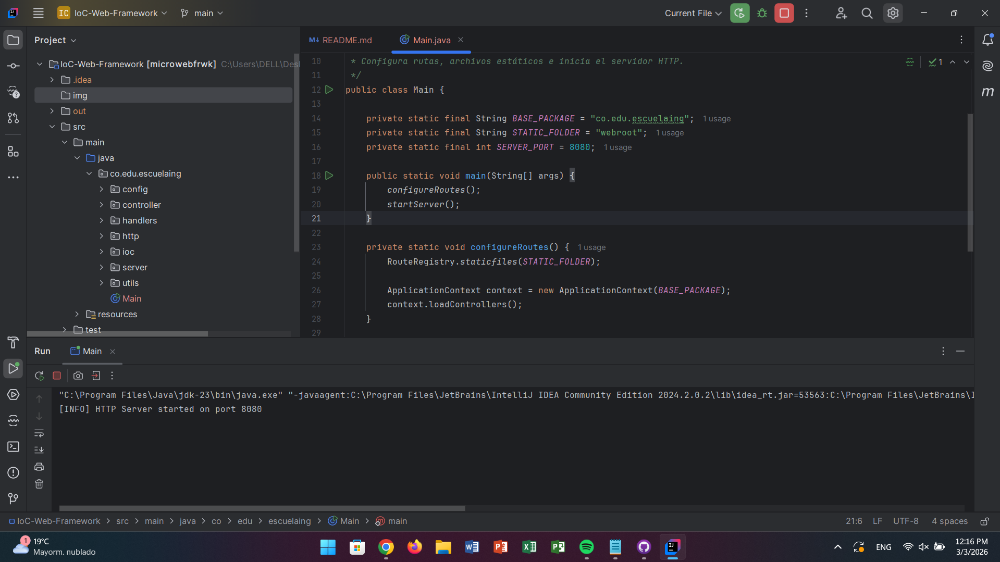

### 2. Greeting Endpoint (Default Parameter)

Request:

```
GET http://localhost:8080/greeting
```

Expected response:

```
Hola World
```

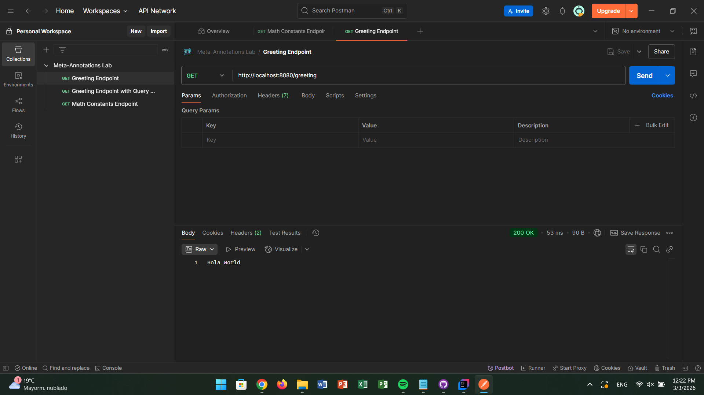

### 3. Greeting Endpoint with Query Parameter

Request:

```
GET http://localhost:8080/greeting?name=Santiago
```

Expected response:

```
Hola Santiago
```

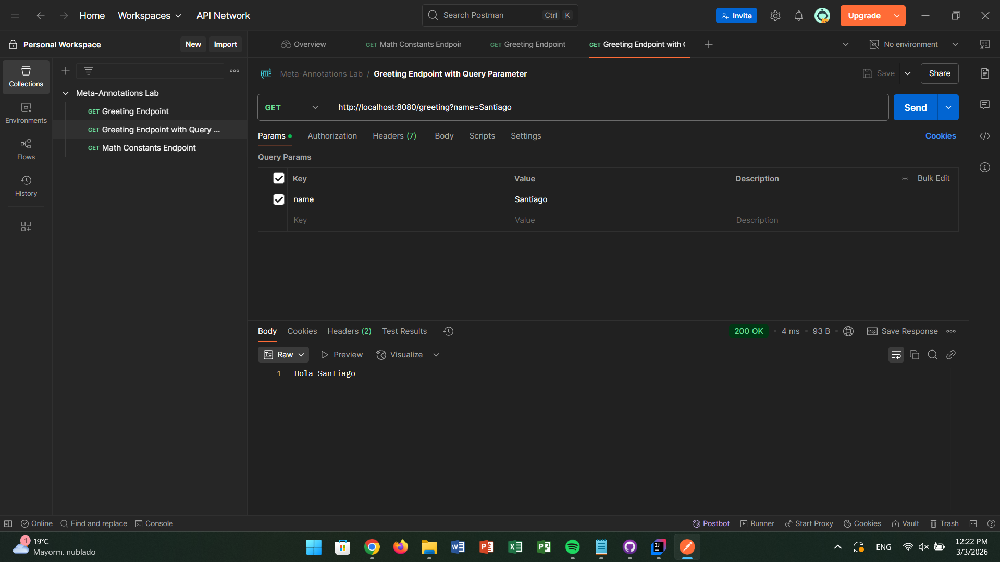

This screenshot demonstrates:

* Proper query parameter extraction.
* `@RequestParam` resolution.
* Reflection-based invocation of the controller method.

### 4. Math Constants Endpoint

Request:

```
GET http://localhost:8080/math/constants/pi
```

Expected response:

```
3.141592653589793
```

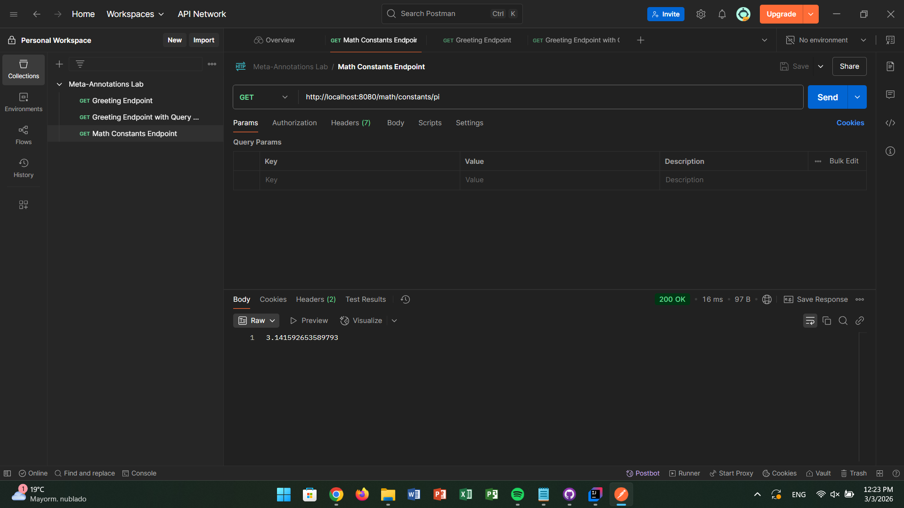

This demonstrates hierarchical resource-based URI design (Richardson Level 1).

### 5. Static File Serving

Request:

```
http://localhost:8080/index.html
```

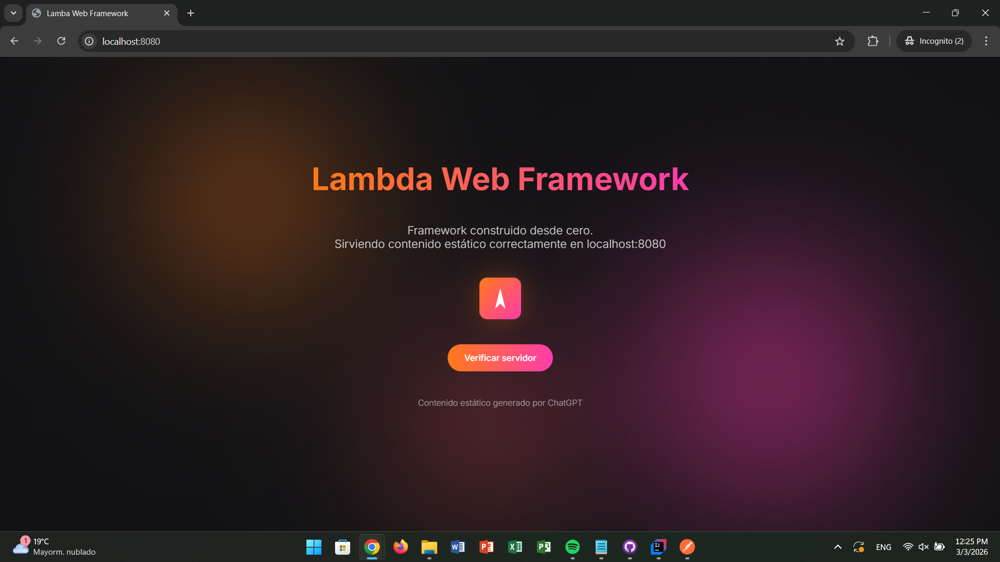

This confirms:

* `RouteRegistry.staticfiles("webroot")` configuration
* Fallback to `StaticFileHandler`
* MIME type resolution via `MimeTypeMapper`

### 6. Automated Test Execution

Execution:

```bash
mvn test
```

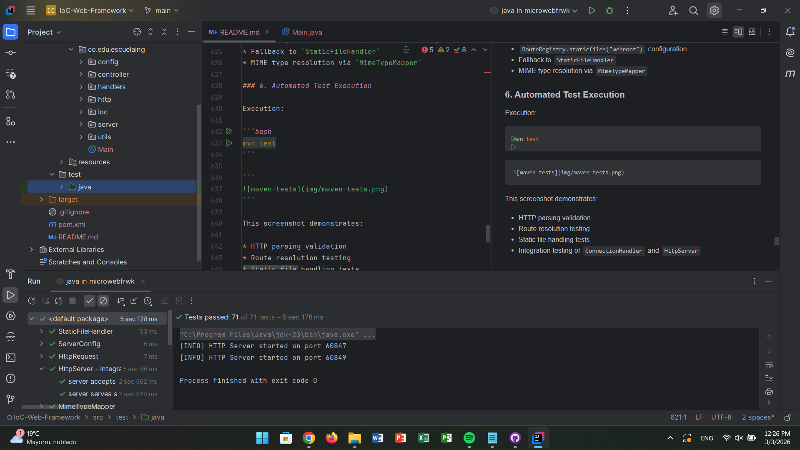

This screenshot demonstrates:

* HTTP parsing validation
* Route resolution testing
* Static file handling tests
* Integration testing of `ConnectionHandler` and `HttpServer`

### 7. JAR Packaging

Build command:

```bash
mvn clean package
```

Resulting artifact inside `out/`:

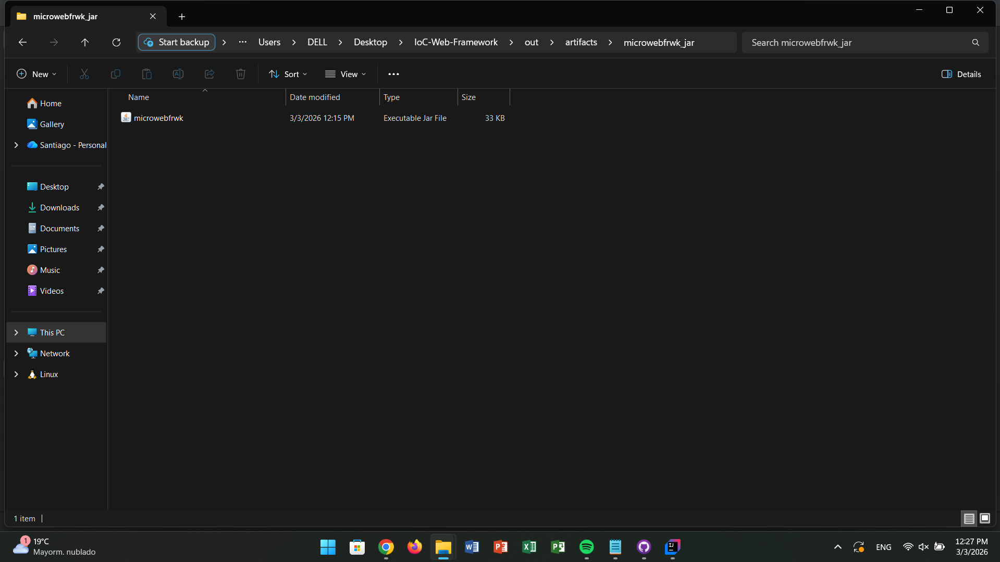

This confirms generation of the executable artifact used for deployment.

### 8. AWS EC2 Instance Running

Screenshot of the EC2 instance dashboard showing:

* Running state
* Public DNS
* Security Group with port 8080 exposed

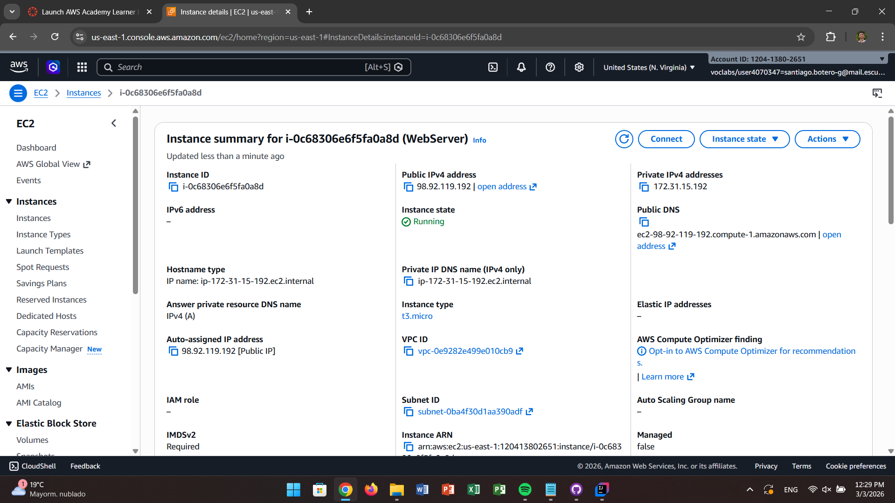

### 9. Application Running on AWS (Public DNS)

Access via:

```
http://ec2-98-92-119-192.compute-1.amazonaws.com:8080
```

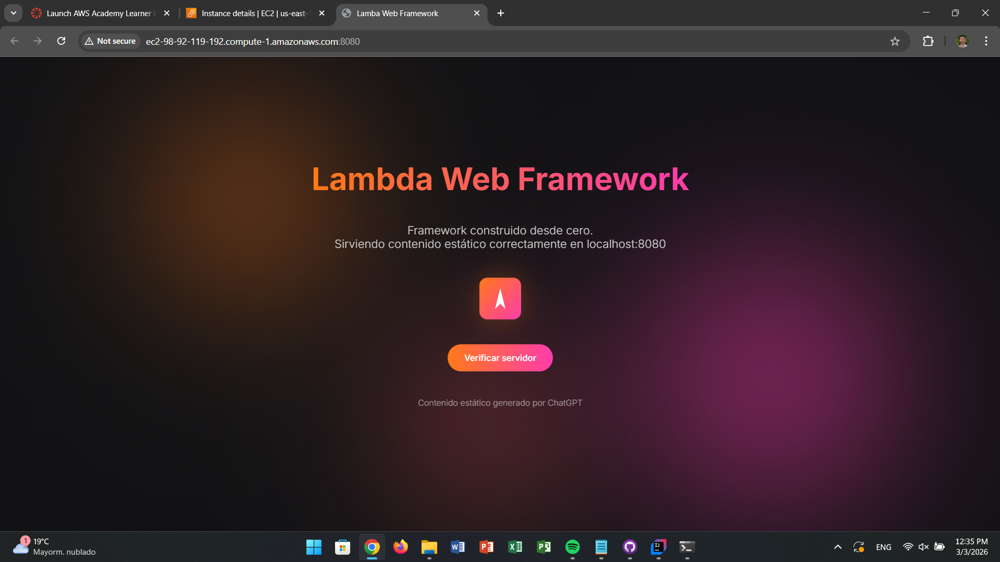

This confirms:

* Successful deployment
* Remote execution of the JAR
* Public internet accessibility
* Proper exposure of port 8080

### 10. Testing `greetings?name=Santiago` Endpoint

Access via:

```
http://ec2-98-92-119-192.compute-1.amazonaws.com:8080/greetings?name=Santiago
```

Expected behavior:

* The application processes the `name` query parameter
* Returns a personalized greeting message
* Confirms correct handling of HTTP query parameters
* Validates controller/service layer functionality

Example response:

```
Hello Santiago
```

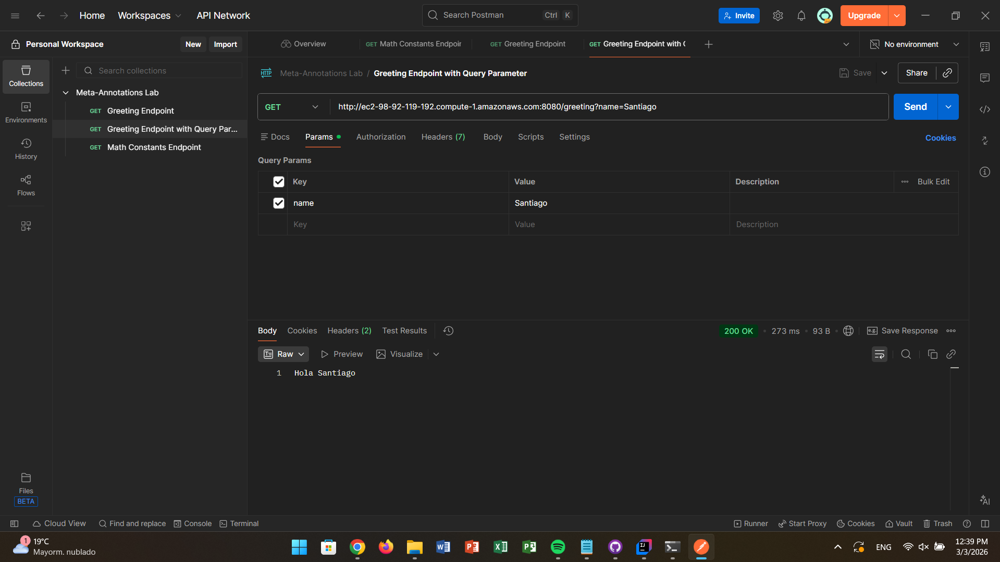

This confirms:

* Query parameter binding works correctly
* Endpoint routing is functioning
* The deployed application responds dynamically

### 11. Testing `math/constants/pi` Endpoint

Access via:

```
http://ec2-98-92-119-192.compute-1.amazonaws.com:8080/math/constants/pi
```

Expected behavior:

* The endpoint returns the mathematical constant π
* Confirms static resource/controller mapping
* Validates additional API route configuration

Example response:

```
3.141592653589793
```

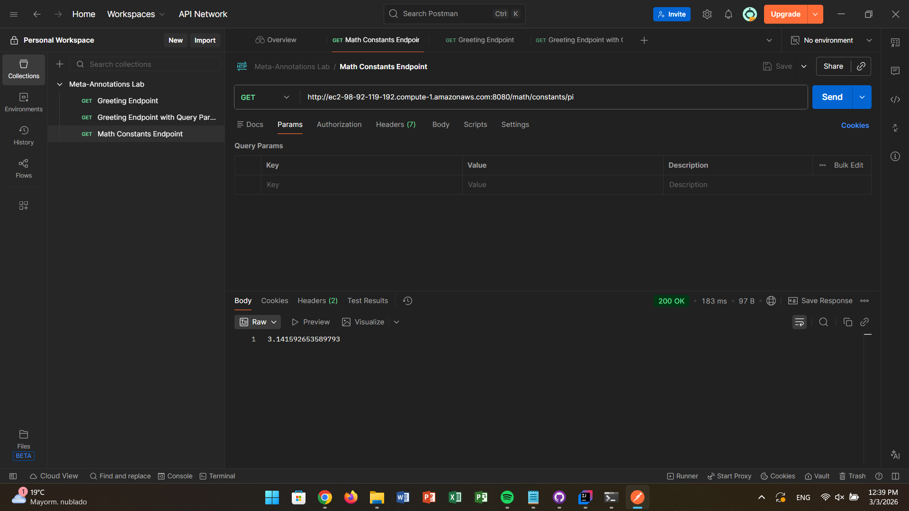

This confirms:

* Additional REST endpoint exposure
* Correct backend computation/constant retrieval
* Full API functionality on the deployed AWS EC2 instance

### 12. SSH Session Running the JAR

Terminal session showing:

```bash
java -jar microwebfrwk.jar
```

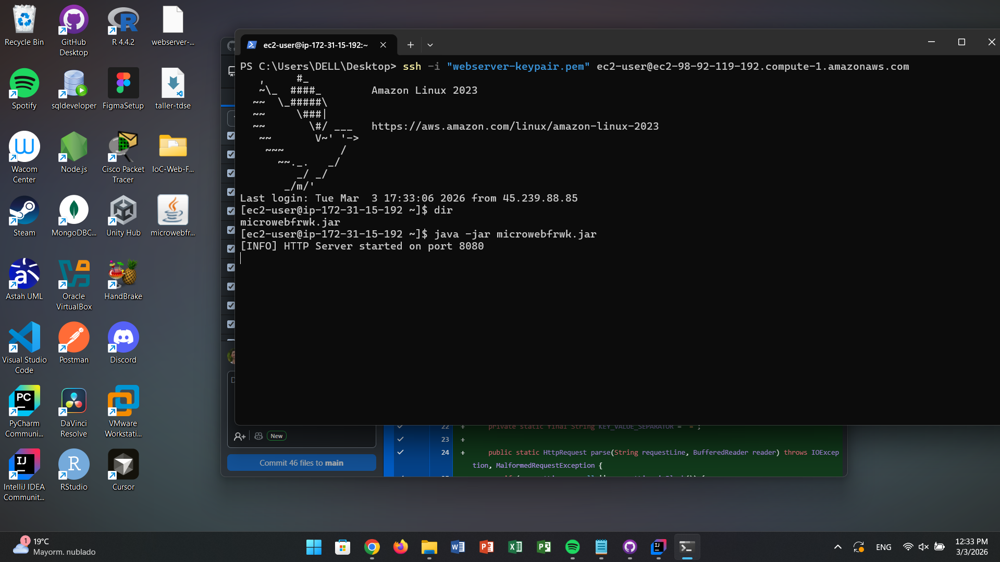

This validates:

* Java 21 installation
* Execution on Amazon Linux 2023
* Correct server startup in cloud environment

### Evidence Summary

The screenshots collectively demonstrate:

* Successful local execution.
* Correct annotation scanning and controller registration.
* Query parameter resolution.
* Static file serving.
* Automated test validation.
* JAR packaging.
* Cloud deployment in EC2.
* Public availability via AWS DNS.

These captures validate the complete lifecycle of the project, from development to production-style deployment.

## Outcome and Learning Results

This project demonstrates:

* Deep understanding of TCP socket programming and HTTP protocol handling.
* Reflection and annotation metadata processing in Java.
* Design and implementation of a lightweight IoC container.
* Annotation-driven programming without external frameworks.
* How Spring-style controllers and routing are implemented under the hood.
* REST API modeling with resource-oriented URIs and query parameters.

By reusing the original TCP-based HTTP server and adding annotation-based controllers and an IoC container, the project bridges low-level networking with higher-level, framework-like abstractions.
